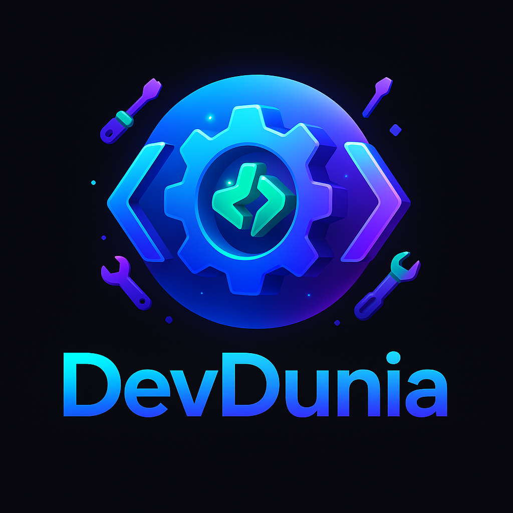

<div align="center">



# 🚀 **DevDunia**

[](https://github.com/echobash/devdunia)
[](https://github.com/echobash/devdunia/fork)
[]()
[](LICENSE)
[](https://devdunia.com)
[](https://devdunia.com)
[](#support-my-work)

## 👥 Contributors

[](https://github.com/echobash/devdunia/graphs/contributors)

[](https://github.com/echobash/devdunia/graphs/contributors)

**Thank you to all contributors who help make this project better!** 🎉

> **100+ essential developer tools including VAPT, encoders, formatters, and more — all free, fast, and privacy-first.**

[](https://devdunia.com)
[](https://github.com/echobash/devdunia)

</div>

---

## ⚡ Quick Start

👉 **[Try it online](https://devdunia.com)** — no installation required.

Perfect for JSON formatting, Base64 encoding, hash generation, password creation, and VAPT security testing — plus 100+ other tools.

---

## ✨ Why DevDunia?

✅ **100+ Tools** — All the essentials in one place  
🔒 **Privacy-First** — Your data never leaves your browser  
⚡ **Lightning Fast** — Works instantly with no server calls  
🆓 **Completely Free** — No ads, subscriptions, or limits  
📱 **Responsive** — Works perfectly on any device  

---

## 🛠️ Popular Tools

| **Category** | **Tools** |
|--------------|-----------|
| 🧩 *Formatters* | JSON Beautifier, XML Formatter, SQL Formatter |
| 🔐 *Encoders* | Base64, URL, HTML Entities, ROT13 |
| ⚙️ *Generators* | Hash (MD5/SHA), GUID, Password, QR Code |
| 🧠 *VAPT Security* | OWASP Top 10, Clickjacking Checker, Security Headers |
| 🌐 *API Tools* | cURL Describer, API Tester, JWT Decoder |
| 🐍 *Python* | Requests, Flask, Pandas, OpenAI Examples |

---

## 🚀 Getting Started

### ▶️ Use Online (Recommended)
Visit **[devdunia.com](https://devdunia.com)** and start using tools instantly.

### 💻 Run Locally
```bash
git clone https://github.com/echobash/devdunia.git
cd devdunia
python -m http.server 8000  # or npx serve .
```

---

## 💝 Support DevDunia

Running DevDunia isn't free — I personally cover all hosting, domain, and infrastructure costs to keep it available 24/7 for everyone, without ads or paywalls.

**If DevDunia saves you time or helps in your projects, please consider supporting its continued development and hosting.** Every small contribution helps keep it free, fast, and privacy-first for the community. 🙌

💬 **Your support directly helps cover:**
- 🖥️ Server bills and hosting costs
- 🌐 Domain renewals and CDN services  
- 🛠️ New tool development and features
- 🔒 Security monitoring and updates

**Keeping DevDunia open for thousands of developers worldwide.**

<div align="center">

[](https://github.com/sponsors/echobash)
[](https://ko-fi.com/echobash)

</div>

---

## 🤝 Contributing

### 🧭 Contribution Guidelines (Quick Overview)

DevDunia welcomes both coding and non-coding contributions.

Before contributing:
- Fork the repository and clone it locally
- Create a separate branch for your changes
- Keep changes small and focused (one fix or improvement per PR)

Non-coding contributions such as documentation improvements, typo fixes, and clarity enhancements are highly appreciated and encouraged for new contributors.
